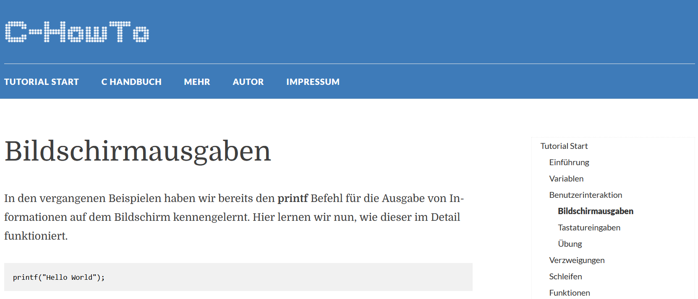

---

title: Printing to Screen
author: soew
version: 1.0
date: 2025-05-28
topic: C-Programming, AIIT, AINF, FI
theme: beige
handout: true

---

# Bildschirmausgaben

C-Programmierung - Kapitel 1

---

## Konventionen für C/C++ Quelltext

- Gehe zu [Bildschirmausgaben](https://www.c-howto.de/tutorial/benutzerinteraktion/bildschirmausgaben) im [C-Tutorial](https://www.c-howto.de/tutorial) von [C-HowTo](https://www.c-howto.de/).

  

- Code-Snippets nach nachstehenden **Konventionen** anpassen.
- Mit Konventionen **persönlichen Programmierstil** entwickeln!

---

### Gliederung des Quelltexts

- Quelltext (engl. *source code*) durch *einzelne* Leerzeilen in **logische Abschnitte gegliedert**.
- Innerhalb eines logischen Abschnitts keine weiteren Leerzeilen setzen.
- Jeder logische Abschnitt erhält einen kurzen **Kommentartext als Überschrift**.
  
  ```cpp
  // print one line of text to screen
  printf("Hello World.\n\n");
  
  // print several lines - only one function call
  printf("Zeile\tEins\n"
      "Zeile\tZwei\n"
      "Zeile\tDrei\n"
      "\tEnde\n\n");
  ```

---

### Kommentartext immer Englisch

- Kommentare ausschließlich in Form kurzer **englischer Phrasen**.

- Source-Code nicht überladen, aber **allgemein verständlich** gestalten, auch für Personen, die kaum oder gar kein C/C++ verstehen.

---

### Selbsterklärende englische Bezeichner

- Als Variablennamen immer **für sich selbst sprechende, englische Bezeichner** wählen.

- Bsp.: Für die Länge und die Breite eines Rechtecks nicht ...

  ```cpp
  int a, b;
  ```

  definieren, sondern, besser ...

  ```cpp
  int rectangleLength, rectangleWidth;
  ```

  oder zumindest:

  ```cpp
  int length, width;
  ```

---

### Zusammengesetzte Bezeichner

- Bei zusammengesetzen Begriffen für eine detaillierte Bezeichnung einer Variable **keine Leerzeichen** möglich! 

- **Einzig mögliches Sonderzeichen** ist hierfür der Unterstrich (engl. *underscore*)**, z.B.,
  
  ```cpp
  char end_of_alphabeth;
  ```

- Die modernere Konvention ist jedoch der **Camel Case**.
  - **Grundsätzlich nur Kleinbuchstaben** (engl. *lower case*) verwenden. 
  - **Großbuchstaben anstatt von Leerzeichen** setzen (engl. *upper case*), die dann wie die Höcker eines Kamels aus dem Bezeichner herausragen, also z.B.,
  
  ```cpp
  char endOfAlphabeth;
  ```

---

## Anzahl der Funktionsaufrufe

- Funktionsaufrufe sind mitunter *teuer* in Bezug auf die **Laufzeit** eines Programms (engl. *runtime*).

- Anzahl der Aufrufe gering halten, z.B.,

  - Bei der Ausgabe von mehreren hintereinanderfolgenden Zeilen Text, nicht den **Ausgabestrom** ständig schließen und wieder öffnen.
  - Es reicht ein Aufruf von `printf()`!

---

## Gemeinsame Übung Bildschirmausgaben

- Erzeuge eine VS-Solution `b01_Bildschirmausgaben.sln`:
  
  - Sprache: C++.
  - Typ: Konsolenanwendung.

- Verwende das C-Template aus [Kap. 0.3](../00-preset/c00.03_C-template.md) als Ausgangspunkt für Deinen Source-Code.

- Erzeuge aus den Code-Snippets des Abschnitts [Bildschirmausgaben](https://www.c-howto.de/tutorial/benutzerinteraktion/bildschirmausgaben) das ***Listing*** eines Übungsprogramms.

- Setze die obenstehenden C-Coding-Konventionen um.

- Versuche jeden Teil des Codes zu verstehen!

---

Nachstehend ein Vorschlag eine mögliche Musterlösung zur Übung Bildschirmausgaben.

```cpp
// b01_Bildschirmausgaben.cpp

#include <cstdio> // printf()

int main()
{
    // print one line of text to screen
    printf("Hello World!\n\n");

    // print several lines of text - one function call only
    printf("Zeile\tEins\n"
        "Zeile\tZwei\n"
        "Zeile\tDrei\n"
        "\tEnde\n\n");

    // print variable character to screen
    char endOfAlphabet = 'x';
    printf("Das Alphabet endet mit: %c\n", endOfAlphabet);
    printf("Der ASCII Code von %c ist %d.\n\n" , endOfAlphabet, 
    endOfAlphabet);

    // print integer numbers to screen
    int length = 312500, width = 50;
    printf("Laenge: %d cm\n"
        "Breite: %d cm\n\n", length, width);

    // right-­align integer numbers
    printf("Laenge: %10d cm\n"
        "Breite: %10d cm\n\n", length, width);

    // print floating point numbers
    float length2 = 312.5789, width2 = 5.6;
    printf("Laenge: %f cm\n"
        "Breite: %f cm\n\n", length2, width2);

    // right-­align and alter precision
    printf("Laenge: %10.2f cm\n"
        "Breite: %10.2f cm\n\n" , length2, width2);

    // print numbers with leading zeros
    int day = 3, month = 9, year = 2007;
    printf("Ein Datum: %02d.%02d.%4d\n", day, month, year);

    // exit success
    return 0;
}
```

---

## Arbeitsauftrag `b01_printToScreen.cpp`
 
- Lege ein Projekt `c01_printToScreen.sln` (Console App, C++) an.

- Verwende das C-Template aus [Kap. 0.3](../00-preset/c00.03_C-template.md) als Ausgangspunkt für Deinen Source-Code.

- Setze die obenstehenden C-Coding-Konventionen um.

- Erzeuge die nachstehenden Bildschirmausgaben, jedoch ...
  
  - Keine Umlaute.
  - Keine Akzente.

---

### Text ausgeben
  
- **Einzeilige Ausgabe** - Das Programm gibt Ihren vollen Namen am Bildschirm aus.
  
- **Mehrzeilige Ausgabe** - Das Programm gibt Ihre vollständige Wohnadresse mindestens dreizeilig untereinander aus. Außerdem soll der letzten Zeile eine Leerzeile folgen.
  
- **Ausgabe von variablen Zeichen** - Speichern Sie die Initialen Ihres Namens in den *char*-Variablen `prename` und `surname` ab und geben Sie die Initialen als variable Werte in einem abgeschlossenen Satz aus, z.B.,

  - "Meine Namens-Initialen sind W. S."

---

### Ausgabe variabler Zahlenwerte
  
- **Ausgabe von ganzen Zahlen** - Geben Sie die längste von Ihnen je gelaufene und die längste von Ihnen je geschwommene Strecke als variable ganzzahlige Werte in Metern rechtsbündig untereinander aus.

    Reservieren Sie dazu bei der Ausgabe jeweils so viele Stellen, wie mindestens notwendig und verwenden Sie Tabulatoreinrückungen, um die unterschiedlich langen Beschreibungstexte auszugleichen.
  
- **Ausgabe von Kommazahlen** - Geben Sie die Lichtgeschwindigkeit in Vakuum (recherchieren Sie im Internet) und die Maximalgeschwindigkeit einer Weltraumrakete als variable Werte in Kilometern pro Sekunde als rechtsbündig ausgerichtete Kommazahlen mit zwei Nachkommastellen untereinander aus.
    
    Reservieren Sie dazu jeweils so viele Stellen, wie mindestens notwendig und verwenden Sie Tabulatoreinrückungen, um die unterschiedlich langen Beschreibungstexte auszugleichen.

---
  
### Abgaben

- Laden Sie die Dokumentation Ihrer Arbeit in die entsprechende Notizbuch-Seite hoch (Kursnotizbuch - Schülerbereich - Arbeitsaufträge - c01_printToScreen):

  1. **Source-Code** - Drucken Sie den Source-Code nach OneNote (oder erzeugen sie eine PDF-Datei und laden Sie sie als Ausdruck hoch). Fügen Sie ihn unterhalb der Arbeitsanweisungen ein (geben Sie ausschließlich Ausdrucke aus Visual Studio ab, keine Bildschirmausschnitte).
  
  2. **Bildschirmausgabe** - Laden Sie einen Bildschirmausschnitt Ihres Programm-Ausgabefensters in die Notizbuch-Seite hoch, als Nachweis, dass Ihr Programm lauffähig ist und die erforderlichen Ausgaben erzeugen kann.

  ---
    