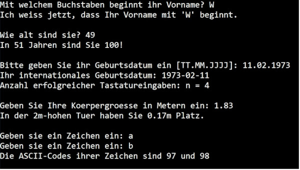

# 2.1 Übung Tastatureingaben

Legen Sie ein Visual-Studio-Solution `c02_Tastatureingaben.sln` (Sprache: C++, Typ: Konsolenanwendung) an, und erzeugen Sie aus den Code-Snippets des Abschnitts [Tastatureingaben](https://www.c-howto.de/tutorial/benutzerinteraktion/tastatureingaben) das Listing eines Übungsprogramms entsprechend den Konventionen von [Kap. 1.1](./c01.01_Bildschirmausgaben.md) und versuchen Sie dabei jeden Teil des C-Codes zu verstehen.

Verwenden Sie das C-Template aus [Kap. 0.3](../00-preset/c00.03_C-template.md) als Ausgangspunkt für Ihren Source-Code und berücksichtigen Sie die Konventionen von [Kap. 1.1](./c01.01_Bildschirmausgaben.md).

Nachstehend ein Vorschlag eine mögliche Musterlösung zur Übung Tastatureingaben.

```cpp
// b02_Tastatureingaben.cpp:

#define _CRT_SECURE_NO_WARNINGS // allow scanf() in VS

#include <cstdio> // printf(), scanf(), getchar()

int main()
{
    // declarations
    int inputs;
    char temp;
    
    // read single character from stdin
    char prename;
    printf("Mit welchem Buchstaben beginnt ihr Vorname? ");
    prename = getchar();
    printf("Ich weiss jetzt, dass Ihr Vorname mit '%c' beginnt.\n\n",
        prename);

    // get integer number
    int age;
    printf("Wie alt sind sie? ");
    inputs = scanf("%d%c", &age, &temp);
    printf("In %d Jahren sind Sie 100!\n\n", 100 - age);

    // store several inputs at once
    int day, month, year;
    printf("Bitte geben Sie ihr Geburtsdatum ein [TT.MM.JJJJ]: ");
    inputs = scanf("%d.%d.%d%c", &day, &month, &year, &temp);
    printf("Ihr internationales Geburtsdatum: %04d-%02d-%02d\n",
        year, month, day);
    printf("Anzahl erfolgreicher Tastatureingaben: n = %d\n\n", inputs);

    // read floating point number
    float height;
    printf("Geben Sie Ihre Koerpergroesse in Metern ein: ");
    inputs = scanf("%f%c", &height, &temp);
    printf("In der 2m-hohen Tuer haben Sie %.2fm Platz.\n\n",
        2.0 - height);

    // empty input buffer - always!!!
    char symbol1, symbol2;
    printf("Geben sie ein Zeichen ein: ");
    inputs = scanf("%c%c", &symbol1, &temp);
    printf("Geben sie ein Zeichen ein: ");
    inputs = scanf("%c%c", &symbol2, &temp);
    printf("Die ASCII-Codes ihrer Zeichen sind %d und %d\n\n",
        symbol1, symbol2);

    // exit success
    return 0;
}
```

Nachstehend der entsprechende Programmlauf:

