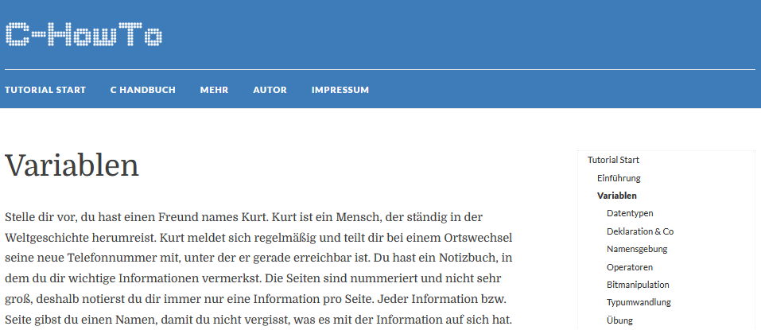
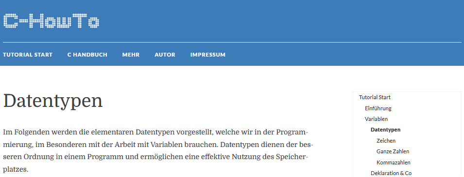
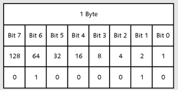
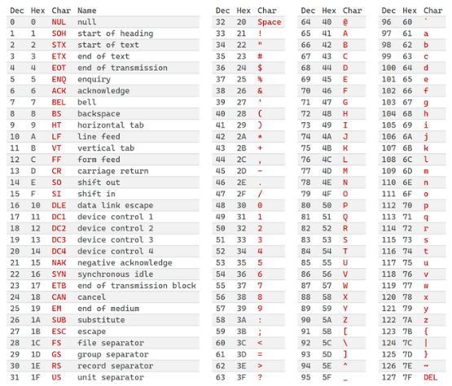
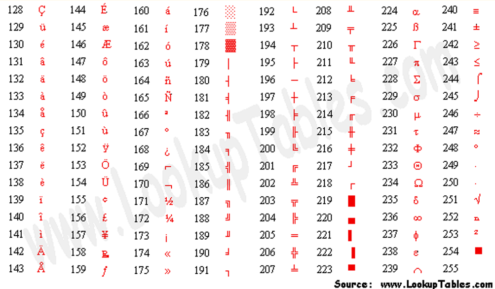
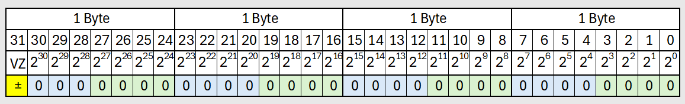
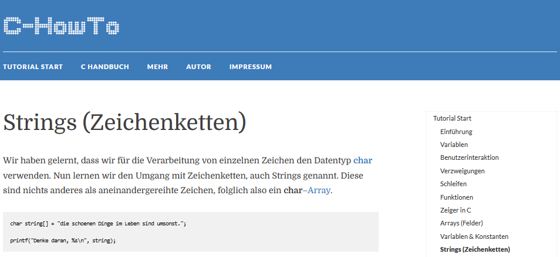
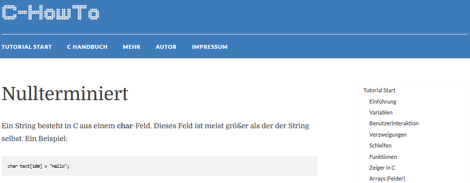
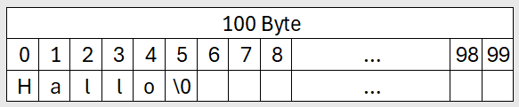

---

title: Integer Data Types
author: soew
version: 1.0
date: 2025-05-19
topic: C-Programming, AIIT, AINF, FI
theme: beige
handout: true

---

# Ganzzahlige Datentypen

C-Programmierung - Kapitel 3

---

## Variablen

- Siehe Kapitel [Variablen](https://www.c-howto.de/tutorial/variablen/) im C-[Tutorial](https://www.c-howto.de/tutorial) von C-HowTo.



---

### Regeln zur Namensgebung

- Siehe [C-HowTo](https://www.c-howto.de/tutorial) &rarr; Unterkapitel [Namensgebung](https://www.c-howto.de/tutorial/variablen/namensgebung/).

- Namensregeln gelten für Bezeichner von ...
  - Variablen
  - Feldern (engl. *arrays*)
  - Funktionen
  - etc.

----

- Erlaubt sind ...

  - Zeichen **A-Z**
  - Zeichen **a-z**
  - Ziffern **0-9** (jedoch nicht am Wortanfang)
  - **Underscore _** (dt. *Unterstrich*) als einziges Sonderzeichen
  
- Nicht erlaubt sind Schlüsselwörter aus dem Sprachumfang von C/C++. Z.B., ...

  - int
  - char
  - return
  - etc.

---

### Konventionen zur Namensgebung
    
- Nicht einzelne Zeichen als Variablennamen verwenden, wie, ...

  ```c
  float s; // distance traveled in km
  float v; // average velocity in km/h
  float t; // travel time in hours
  ```
- Sondern **sprechende englischsprachige Bezeichner**!

- Zusammengesetze Begriffe in **Camel-Case-Notation** setzen, z.B., ...

  ```c
  float distanceTraveled; // in km
  float averageVelocity;  // in km/h
  float travelTime;       // in hours
  ```

---

## Datentypen

- Siehe [C-HowTo](https://www.c-howto.de/tutorial) &rarr; Unterkapitel [Datentypen](https://www.c-howto.de/tutorial/variablen/datentypen/).



---

### Zeichen

- Siehe [C-HowTo](https://www.c-howto.de/tutorial) &rarr; Unterkapitel [Zeichen](https://www.c-howto.de/tutorial/variablen/datentypen/zeichen/). 

- Datentyp `char` (von engl. *character*, dt. *Schriftzeichen*).

- 1 Byte = 8 Bit lange **Binärzahl**.

- Z.B., Schriftzeichen "B" (**ASCII-Code** 66):

$\small 0 \cdot 2^7 + \boldsymbol{1 \cdot 2^6} + 0 \cdot 2^5 + 0 \cdot 2^4 + 0 \cdot 2^3 + 0 \cdot 2^2 + \boldsymbol{1 \cdot 2^1} + 0 \cdot 2^0 = \boldsymbol{66}$



---

#### ASCII-Code

**A**merican **S**tandard **C**ode for **I**nformation **I**nterchange



---

#### Extended ASCII

- Erfordert den Datentyp `unsigned char`.



---

#### Datentyp (`unsigned`) `char`

| Name         | Größe   | Wertebereich ($\small2^8=256$) | Formatzeichen |
| :------------ | -----: | -----------: |:-- |
| `char`          | 1 Byte | -128 **bis** +127 | `%c` |
| `unsigned char` | 1 Byte |     0 **bis** 255 | `%c` |

---

### Ganze Zahlen

- Siehe [C-HowTo](https://www.c-howto.de/tutorial) &rarr; Unterkapitel [Ganze Zahlen](https://www.c-howto.de/tutorial/variablen/datentypen/ganze-zahlen/).

- Datentyp `int` (von engl. *integer*, dt. *ganze Zahl*).

- 4 Byte = 32 Bit lange **Binärzahl** (auf PCs).

- Wertebereich entspricht der **Anzahl möglicher Kombinationen** von 32 Stellen mit jeweils 0 oder 1:

$\small\boldsymbol{2^{32}} = 2^2\cdot2^{10}\cdot2^{10}\cdot2^{10}\approx4\cdot10^3\cdot10^3\cdot10^3\approx\boldsymbol{4\cdot10^9}$



---

#### Datentyp (`unsigned`) `int`

| Name         | Größe   | Wertebereich ($\small2^{32}\approx4\cdot10^9$) | Formatzeichen |
| :------------ | -----: | -----------: |:-- |
| `int`          | 4 Byte | $\small\approx-2\cdot10^9$ **bis** $\small\approx+2\cdot10^9$ | `%i` **oder** `%d` |
| `unsigned int` | 4 Byte | $\small0$ **bis** $\small\approx4\cdot10^9$ | `%i`**,** `%d` **oder** `%u` |

---

### Zeichenketten (Strings)

- Siehe [C-HowTo](https://www.c-howto.de/tutorial) &rarr; Kapitel [Strings (Zeichenketten)](https://www.c-howto.de/tutorial/strings-zeichenketten/).
- Felder (engl. *arrays*) vom Typ `char` werden auch **C-Strings** genannt.



---

#### Wert abrufen vs. Adresse abrufen

| Objekt   | Deklartion           | Wert lesen | Adresse lesen |
| :------- | :------------- | :----------- | :-------------- |
| Variable | `char oneLetter;`    | `oneLetter;`   | `&oneLetter;`   |
  | Feld   | `char someTxt[24];` | `someTxt[0];` | `someTxt;` |

- Anmerkungen:

  - Die Deklaration `char someTxt[24];` erzeugt ein Feld mit 24 Einträgen vom Typ `char`, zum Speichern und Verarbeiten von Zeichenketten.

  - Die Anweisung `someTxt[0];` liest **den ersten Feldeintrag**, also nur den Anfangsbuchstaben der gespeicherten Zeichenkette.

---

#### Nullterminierung von Strings

- Siehe [C-HowTo](https://www.c-howto.de/tutorial) &rarr; Kapitel [Nullterminiert](https://www.c-howto.de/tutorial/strings-zeichenketten/nullterminiert/).
- ASCII-Wert `null` ist Steuerwert "**End of String**".





---

## Übung `b03_strings`

- C++ Template und Übungs-Angaben

```c
/*
************************************************************************

b03_strings.cpp

Programm zum Einlesen und Ausgeben des Namens und des Geburtsdatums:

Es sollen ...
  - Vorname (als Zeichenkette, engl. string),
  - Nachname (string),
  - Tagzahl (ganze Zahl)
  - Monat (string) und
  - Jahr (ganze Zahl)
einzeln eingelesen werden und der Name, die Initialen und das Datum in
geschlossender Form wieder ausgegeben werden.

Formatierung der Ein- und Ausgabe mit Leerzeichen, Leerzeilen und
Tabulator-Einrueckungen wie folgt:

G:\SOEW\AINF\b03_strings> b03_strings.exe

        Geben Sie Ihren Namen ein:
        Vorname:  Walter
        Nachname: Soellinger

        Geben Sie Ihr Geburtsdatum ein:
        Tag:      18
        Monat:    August
        Jahr:     2007
        
        Hallo, Walter Soellinger,
        Ihre Initialen lauten W. S.
        Ihr Geburtstag ist der
        18. August 2007.

G:\SOEW\AINF\b03_strings>

************************************************************************
*/

#define _CRT_SECURE_NO_WARNINGS // allow scanf() in Visual C++

#include <cstdlib>   // system()
#include <cstdio>    // printf(), scanf()
#include <iostream>  // cin, cout, endl
using namespace std; // std::cout ---> cout


/* main program */
int main()
{
    
    /* wait for keystroke */
    // system("PAUSE");
    
    /* done */
    return 0;
}
```

- Abgabe im Kursnotizbuch - Arbeitsaufträge ...

  - Quellcode von `b03_strings.cpp` als PDF und Ausdruck

  - Bildschirmausschnitt der Programmausgabe
