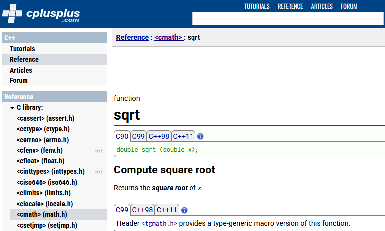

---

title: Floating Point Numbers
author: soew
version: 1.0
date: 2025-05-21
topic: C-Programming, AIIT, AINF, FI
theme: beige
handout: true

---

# Floating Point Numbers (Kommazahlen)

C-Programmierung - Kapitel 4

---

## Kommazahlen

- Siehe Kapitel [Kommazahlen](https://www.c-howto.de/tutorial/variablen/datentypen/kommazahlen/) im C-[Tutorial](https://www.c-howto.de/tutorial) von C-HowTo.

---

### Die Gleitpunkttypen `float` und `double`

- Siehe entsprechendes [Unterkapitel](http://openbook.rheinwerk-verlag.de/c_von_a_bis_z/005_c_basisdatentypen_008.htm#mj357b36b759cbb526c1701f1341d99a96) im [C-Kompendium](https://openbook.rheinwerk-verlag.de/c_von_a_bis_z/index.htm) von Jürgen Wolf.

---

### Datentyp `float`

- Von engl. **floating point number** (dt. *Gleitpunkt-Zahl*).
- Anmerkung: Das Dezimalzeichen ist im Englischen ein **Punkt** und kein Komma!
- Speichergröße 4 Byte = 32 bit.
- Früher der Standard-Datentyp für Kommazahlen auf PCs.
- **Geringe Genauigkeit** von nur 6-7 Stellen!

---

### Datentyp `double`

- Von engl. **double precision**, (dt. *doppelte Genauigkeit*).
- Speichergröße: 8 Byte = 64 bit.
- **Standarddatentyp** für Kommazahlen auf PCs!
- **Genauigkeit** mind. 15 Stellen!

---

## Mathematische Funktionen

- Umfang der C/C++ Mathematik-Bibliothek, z.B., in der [Referenz](http://cplusplus.com/reference/cmath) von [cplusplus.com](https://cplusplus.com/).

  - Kurze Funktionsbeschreibung (engl. *Summary* oder *Synapsis*).
  - Parameter (auch: *Argumente*).
  - Rückgabewert (engl. *return value*).
  - Code-Beispiele (engl. *Example*)

