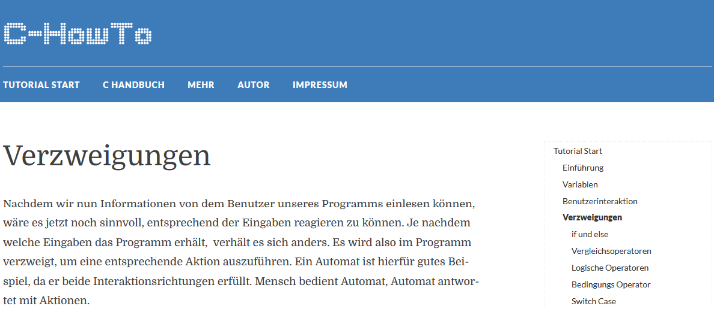
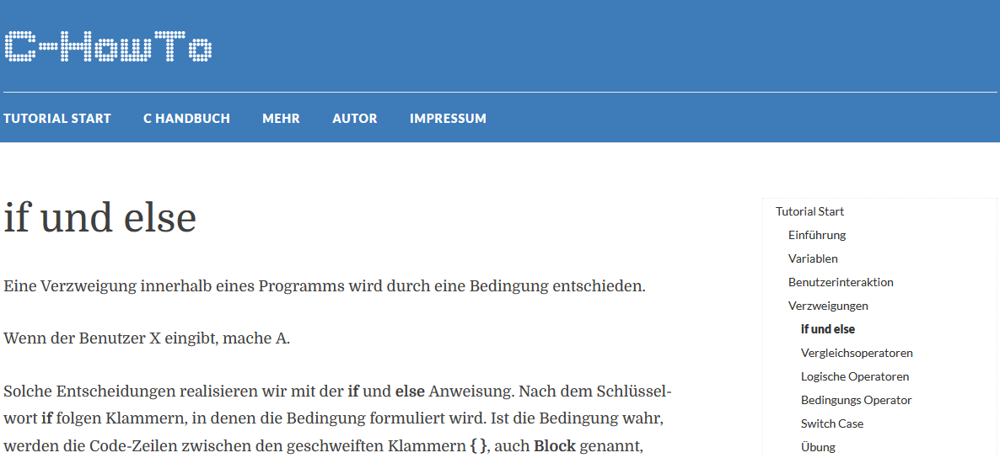

---

title: Conditional Statements
author: soew
version: 1.0
date: 2025-06-17
topic: C-Programming, AIIT, AINF, FI
theme: beige
handout: true

---

# Verzweigungen

C-Programmierung - Kapitel 5

---

## Verzweigungen - Intro

- Siehe Kapitel [Verzweigungen](https://www.c-howto.de/tutorial/verzweigungen/) im C-[Tutorial](https://www.c-howto.de/tutorial) von C-HowTo.

---

## `if`-`else`-Anweisung

- Siehe Unterkapitel [if und else](https://www.c-howto.de/tutorial/verzweigungen/if-und-else/).

---

## Übungsaufgabe

- Erstelle ein Programm, das das Volumen eines Würfels berechnet und am Bildschirm ausgibt.

- Die Kantenlänge wird über die Tastatur eingegeben.

- **Falls** eine positive Kantenlänge eingegeben wird, solldas richtige Ergebnis berechnet und am Bildschirm ausgegeben werden, **ansonsten** soll die Ausgabe einer Fehlermeldung erfolgen.

- [&rarr; Lösung](./c05_if-else-xrcs.md)

---

## Vergleichsoperatoren

- Siehe Unterkapitel [Vergleichsoperatoren](http://www.c-howto.de/tutorial/verzweigungen/vergleichsoperatoren/)

| Vergleich           | Operator |
| :------------------ | :------: |
| ungleich	          | `!=`     |
|    gleich           | `==`     |
| größer	          | `>`      |
| größer oder gleich  | `>=`     |
| kleiner             | `<`      |
| kleiner oder gleich | `<=`     |

---

