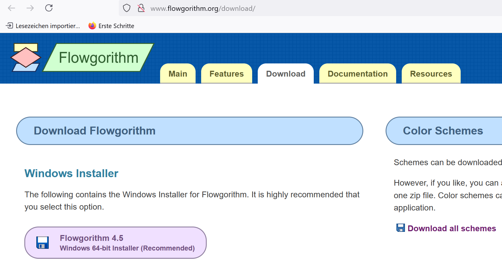

---

title: Nesting / Switch
author: soew
version: 1.0
date: 2025-06-23
topic: C-Programming, AIIT, AINF, FI
theme: beige
handout: true

---

# Verschachtelnung und Fallunterscheidung

C-Programmierung - Kapitel 6

---

## Verschachtelung von Verzweigungen

- Siehe Unterkapitel [if und else](https://www.c-howto.de/tutorial/verzweigungen/if-und-else/).


---

### Syntax bei Verschachtelung

- In den Nein-Zweig einer Verzweigung wird eine weitere Verzweigung verschachtelt (engl. *nesting*).

```c++
if ( /* condition 1 */ )
{
    /* statements 1 */
}
else
{
    if ( /* condition 2 */ )
    {
        /* statements 2 */
    }
    else
    {
        /* statements 3 */
    }
}
```

---

### Verkürzte Syntax

- Besteht ein Block von Anweisungen nur aus einer Anweisung, können die geschwungen Klammern `{ ... }` weggelassen werden.

- Eine `if`-`else`-Anweisung ist nur eine Anweisung, daher kann verkürzt codiert werden:

```c++
if ( /* condition 1 */ )
{
    /* statements 1 */
}
else if ( /* condition 2 */ )
{
    /* statements 2 */
}
else
{
    /* statements 3 */
}
```

---

## Flussdiagramme

- Auch Ablaufdiagramm (engl. *flow chart*).

- Erzeugung, z.B., mit `flowgorithm.exe`.

  - Didaktisches Hilfsmittel beim Entwurf von Programmabläufen (auch *Algorithmus*, engl. *algorithm*).

  - *Flowgorithm*: Wort-Kreation aus **Flow Chart** und **Algorithm**.

  - [&rarr; Download flowgorithm.exe](http://www.flowgorithm.org/download/)



---

## Übungsaufgabe `nesting_v1.cpp`

- Das Programm fordert zur Eingabe einer Kommazahl x auf:

  ```
  Geben Sie eine beliebige Dezimalzahl ein: x = _
  ```

- Anschließend wird am Bildschirm ein Auswahlmenü ausgegeben:

  ```
  Auswahlmenue: Waehle ...
  ----------------------------------
   ... [s] fuer Sinus von x
   ... [c] fuer Kosinus von x
   ... [q] fuer Quadratwurzel von x
  ----------------------------------
  
  Treffen Sie Ihre Auswahl: _
  ```

- Die Auswahl des Users wird von der Tastatur eingelesen und als `char`-Wert
abgespeichert.

---

- **Falls** die Auswahl gleich `'s'` ist, soll der Sinus von x berechnet und am
Bildschirm ausgegeben werden.
   
- **Ansonsten**, **falls** die Auswahl gleich `'c'` ist, soll der Kosinus von x
berechnet und ausgegeben werden.
   
- **Ansonsten**, **falls** die Auswahl gleich `'q'` ist, soll die Quadratwurzel von
x berechnet und ausgegeben werden.
   
- **Ansonsten** soll die Fehlermeldung "Auswahl nicht definiert!"
ausgegeben und das Programm mit dem Fehler-Code 1 geschlossen werden.

---

### Abgabe Nesting Variante 1

- Flussdiagramm zu Variante 1
  - Menü "Tools" in Flowgortithm.exe,
  - "Copy Image to Clipboard" oder "Export an Image File",
  - Mit ausreichender Auflösung als Ausdruck in OneNote einfügen.
        
- Flowgorithm-Ausgabe zu allen vier möglichen Programmabläufen
  - Als Bildschirmausschnitte.
        .
- C/C++ Source-Code zu Variante 1
  - Als PDF und als Ausdruck.
        
- Konsolen-Ausgabe zu allen vier möglichen Programmabläufen
  - Als Bildschirmausschnitte.

